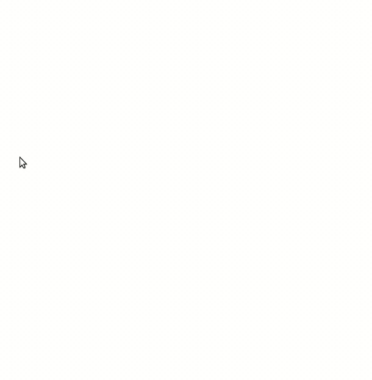

# Ulauncher Döviz v1.0

[](https://github.com/nesivmi/ulauncher-doviz)

> [Döviz v1.0](https://github.com/nesivmi/ulauncher-doviz)


## Ön Sunum


## Gereklilikler

* [Ulauncher](https://github.com/Ulauncher/Ulauncher) 5.0+

## Yükleme

Ulauncher'ı açın ve preferences window -> extensions -> add extension kısmına aşağıdaki linki yapıştırın:

```
https://github.com/nesivmi/ulauncher-doviz
```

## Kullanım

"döviz" veya değiştirdiğiniz anahtar kelimeyi yazmanız yeterlidir.

## Ayarlar

* **Döviz** - Bu uzantıyı çalıştıran ana kelime. İsteğinize göre değiştirebilirsiniz.
* **Döviz0..6** - doviz.com adresinden herhangi bir döviz türünün linkini giriniz. Yazım şu şekilde olmalıdır;
```
GRAM ALTIN;https://altin.doviz.com/gram-altin
```
Not: Aradaki bölme işareti noktalı virgül (;) olmalı.




## Uyarı
* **Bağlantı hızına göre verinin internetten çekilmesi zaman alabilmektedir.**

## Links

* [doviz.com](https://www.doviz.com/)
* [Ulauncher Extensions](https://ext.ulauncher.io/)
* [Ulauncher 5.0 (Extension API v2.0.0) — Ulauncher 5.0.0 documentation](http://docs.ulauncher.io/en/latest/)
